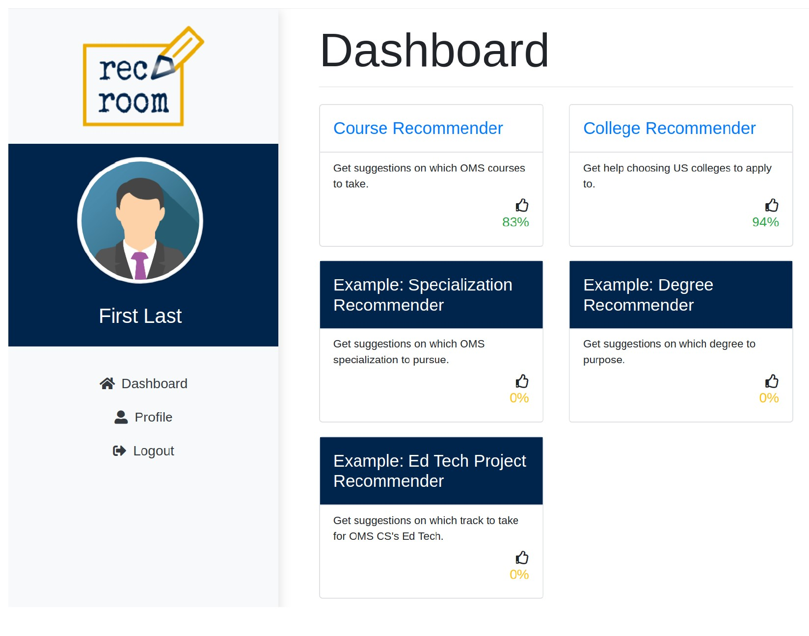
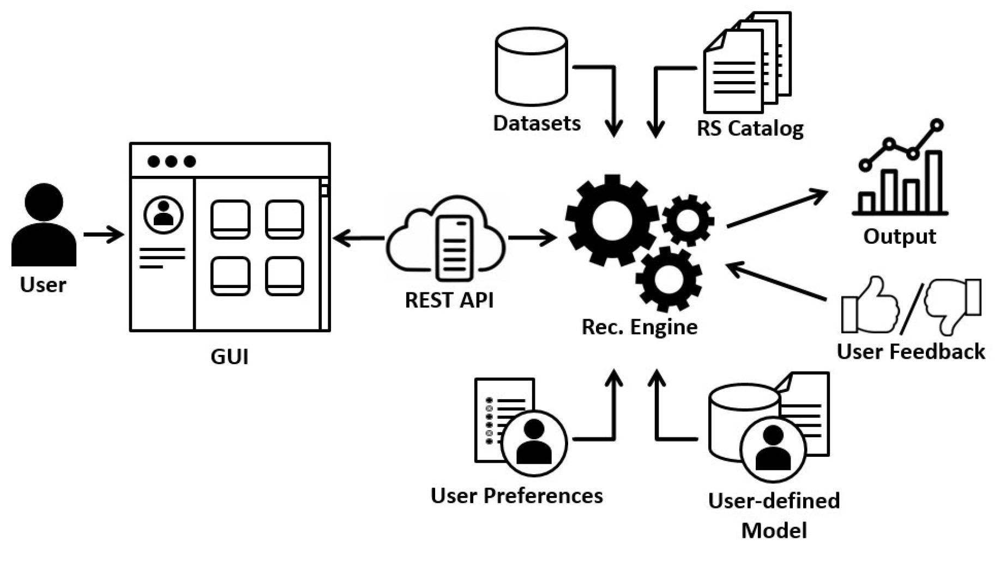
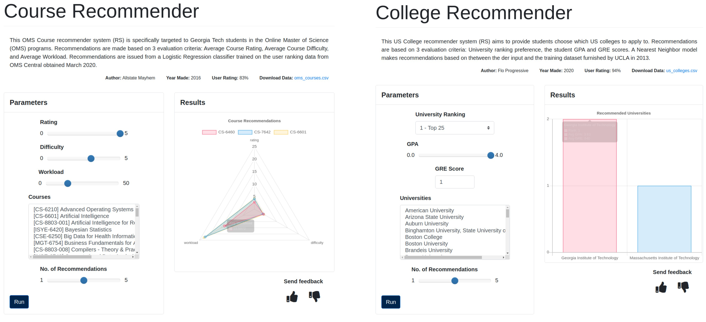

# rec-room

Welcome to the `Recommender Room`, or `Rec Room`, for short. The `Rec Room` is a platform that provides students with valuable, on-demand access to academic support services, traditionally offered only in-person, via its suite of recommender systems.



The `Rec Room` is a web application made as part of a project in the Development Track in CS 6460 - Education Technology at  Georgia Tech. The application was developed in  `Python 3.7` on Linux Mint 18 / Ubuntu 16.04 LTS and further tested on Ubuntu 18.04.3 and the `Chrome` browser.

**Contents of this document**
- [Quickstart]
- [Installation]
- [User Guide]
- [API]
- [Recommender Systems]
- [Pseudo-Database]
- [File Structure]
- [Sphinx Docs]
- [Miscellaneous]
- [Contact]

## Quickstart

This section will review only the minimum number of steps to get the `Rec Room` up and running. The steps outlined are covered more thoroughly in the latter sections. These steps assume you have an `Anaconda` distribution that supports `Python 3.7` as your Python platform.

1. Open your terminal and create a new Python environment via `Anaconda`.
    ```
    conda create -n pyrec37 python=3.7 --yes && conda activate pyrec37
    ```
    
2. Unzip and Install the `Rec Room` (note the `-e` flag and `.`).
    ```
    cd ~/rec-room
    pip install -e .
    ```
    
3. Run the application (from your terminal).

    ```
    rec 
    ```
    
4. Open your browser (preferably `Chrome`) and navigate to the `Login` page.

    http://localhost:1337/recroom/v1.0/login 

5. Create a new account or use the default account provided (without quotes):

    - username: "jake"
    - password: "statefarm"
    
If you were able to successfully install and run the `Rec Room`, then you can proceed to the [User Guide] for a more detailed explanation on how to use the application, otherwise refer to the [Installation] section.

## Installation

This section will list the installation steps; please follow them for reproducibility. These steps assume you have an `Anaconda` distribution that supports `Python 3.7` as your Python platform. If installed, proceed to [Step 1], otherwise, you can skip to [Step 2] or install `Anaconda` from their [website]. Please see [Troubleshooting] for additional assistance. 

> Note: `Anaconda` is not absolutely needed, but is recommended to ensure reproducibility. 

#### Step 1

Create the `pyrec37` Python environment and activate it. The `--yes` flag accepts the default `conda` packages.

    conda create -n "pyrec37" python=3.7 --yes
    conda activate pyrec37
    
On older versions of `Anaconda`, you may need to activate using `source` instead of `conda`:

    source activate pyrec37
    
#### Step 2
Install the `Rec Room` by unzipping the downloaded `rec-room.zip` or cloned Georgia Tech [git repo], and navigating into the `rec-room` directory. 

    cd ~/rec-room
    pip install -e .
    
> Note: Please include the `-e` flag in the `pip` install.
    
This will ensure that the `Rec Room` application, and all of its Python dependencies listed in `setup.py`, are installed in your environment. 

#### Step 3
If installed correctly, the `Rec Room` will now be available as an executable binary, `rec`, which can be called from your terminal. Verify your installation was successful by entering the following command in your terminal:

    rec --help

You should see the available arguments of the application as shown below:
```
usage: rec [-h] [-v] [-o HOST] [-p PORT] [-cfg {debug,live}]

Recommender Room

optional arguments:
  -h, --help            show this help message and exit
  -v, --verbose         display additional information to the terminal
  -o HOST, --host HOST  select hostname or IP address for the web application
  -p PORT, --port PORT  select port for the web application
  -cfg {debug,live}, --configuration {debug,live}
                        set the appropriate configuration settings for the web
                        application
```

#### Troubleshooting
I have provided two additional files, `env.yml` and `requirements.txt`, both located in the `rec-room` directory, for cress-referencing with my own development environment. 
- `env.yml` contains a list of the Python packages that were installed upon creating my `conda` environment. If you were unable to create the `conda` environment as described in [Step 1], try installing from this file by running the following command in your terminal:
    ```
    conda create --name pyrec37 --file env.yml
    ```

- `requirements.txt` contains the list of Python packages that were installed via `pip`. These packages are dependencies required to install the `Rec Room` application. If you were unable to install the application as described in [Step 2], proceed to run the following command in your terminal:
    ```
    pip install -r requirements.txt
    ```
    After `pip` has finished installing, return to [Step 2] to complete the installation of the `Rec Room`.

## User Guide

As mentioned, the `Rec Room` is a web application. It was built using a Model-View-Controller software design pattern, meaning it has a frontend Graphical User Interface (GUI) that can be accessed by a browser and a backend Application Program Interface (API) which accepts `POST` and `GET` HTTP requests. You must have a browser available - preferably `Chrome` - to interact with the GUI. Flat files, CSVs, are used as pseudo-databases (see [Pseudo-Database] section).

 

The instructions below will step you through the process of running the application. Please refer to the [API] section for more information on the URL endpoints available.

#### 1. Running the Application
Run the application from your terminal by entering:

    rec
    
This will start a Python web server using `Flask`. You should see the following (or similar) output on your terminal.

```
 * Serving Flask app "rec_room.rec_api" (lazy loading)
 * Environment: production
   WARNING: This is a development server. Do not use it in a production deployment.
   Use a production WSGI server instead.
 * Debug mode: on
 * Running on http://127.0.0.1:1337/ (Press CTRL+C to quit)
 * Restarting with stat
 * Debugger is active!
 * Debugger PIN: 232-151-431
```

By default, the host and port numbers will be `localhost` (or `127.0.0.1`) and `1337`, respectively. Alternatively, you could specify the host and port numbers to use by passing the `--host` and `--port` flags. Please refer to the [Flask documentation] for more details.

You can now open your browser and navigate to the `Rec Room`'s landing page by entering http://localhost:1337/ in your browser's address bar. You should see a webpage with the following text:

    Recommender Room - Rec Room
    
#### 2. Navigate to the Login Page

Now that we have verified the application is reachable from your browser, proceed to the login page by entering http://localhost:1337/recroom/v1.0/login in your browser's address bar. You should now see the `Login` page with a "Welcome" message.

#### 3. Login to the Application

You can now use the `Rec Room`. From here, proceed to log in with an existing account or create a new one. 

A default account is already created for you with the following information (without the quotes):
- Username: "jake"
- Password: "statefarm"

To create a new account, click the `Sign Up` tab and enter the information. You will be notified if the existing username already exists.

Once logged in, you will be redirected to the `Dashboard` page.

#### 4. Run a Recommendation

From the Dashboard, you can select any of the available Recommender Systems (RSs) in the "cards". The title of the RS is a link that will redirect you to the corresponding RS page. At the time of this writing, there are two working RSs and, therefore, links which you can click on:
 - Course Recommender
 - College Recommender

Clicking the link will redirect you to the RS-specific page, where you will be presented with 3 interactable components:
- **Data**: Each RS will have a `Download Data` label, where users can view/download the dataset(s) the RS uses to make recommendations. Clicking these links will display the data in a new page. Users are encouraged to review the data since it is what the RS bases its recommendations on. Further, users can utilize the data to validate the RS results or make their own RS with the data.
- **Parameters**: The criteria the RS uses to make recommendations is located in the `Parameters` component. Here, you can change the values of the evaluation criteria. Input methods can vary, such as range sliders, multi-select box, or input field. When ready, click the `Run` button.
- **Results**: Initially, the `Results` component will only display "Please run recommendation" text. This component will be populated with a diagram once a recommendation is run from the `Parameters` component. The diagram will be interactable with hovering or clicking actions. Lastly, you can submit a "thumbs-up" or "thumbs-down" response for the RS recommendation. 

Refer to the [Recommender Systems] section below for more information on the RSs. 

#### 5. Edit Your Profile

You can edit your account as needed by clicking the `Profile` button on the left-panel menu. This will redirect you to the `User Profile` page where the account information will be pre-populated based on how the profile was originally created. Two fields, the `Username` and `Password`, will be special cases, however, as the `Username` is not editable and the `Password` is blank (not shown). Changes will not be saved until the `Update` button is clicked.

#### 6. Logout

End your session and log off from the application by clicking the `Logout` button on the left-panel menu. You can now shut-off the application by returning to your terminal and pressing `CTRL`+`C`.

## API

The `Rec Room` is a web application that only accepts `GET` and `POST` HTTP requests. `GET` requests are reserved for displaying GUI information, while `POST` requests are meant for exchanging data between the user and the backend server (e.g., logging in or running a recommendation). 

The root URL of the application is:

    http://{host}:{port}/recroom/v1.0/{endpoint}    
    
The `{host}` and `{port}` should be replaced with the actual values the application is using. Using the default values mentioned at the beginning of this section, the base URL would be `localhost:1337`. Again, these values can be changed at runtime by passing the appropriate flags. 

To reach the `Login` page using the default options, for example, you would navigate to:

    http://localhost:1337/recroom/v1.0/login

The tables below lists all the endpoints that are available and their required parameters for each request. All request bodies should have content type `application/json` and be valid `JSON`.

#### Endpoint: Login

Displays `Login` page to the user. Users can login or create a new user.

| Method 	| URL    	| Parameters                                                                                                                                                                                                                                                                    	| Example                                                              	|
|--------	|--------	|-------------------------------------------------------------------------------------------------------------------------------------------------------------------------------------------------------------------------------------------------------------------------------	|----------------------------------------------------------------------	|
| `GET`  	| /login 	| `NA`                                                                                                                                                                                                                                                                          	| `NA`                                                                 	|
| `POST` 	| /login 	| - user:str<br>- password:str<br>- action:str<br>- first_name:str (_optional_)<br>- last_name:str (_optional_)<br>- university:str (_optional_)<br>- major:str (_optional_)<br>- designation:str (_optional_)<br>- grad:str (_optional_)<br>- interests:list[str] (_optional_) 	| {<br> "user": "jake",<br> "password": "statefarm",<br> "action": "login"<br>} 	|

#### Endpoint: Dashboard

Displays `Dashboard` page to the user. This is the central page of the `Rec Room`; users can navigate to all endpoints from here.

| Method 	| URL        	| Parameters 	| Example 	|
|--------	|------------	|------------	|---------	|
| `GET`  	| /dashboard 	| `NA`       	| `NA`    	|
| `POST` 	| /dashboard 	| `NA`       	| `NA`    	|


#### Endpoint: Profile
Displays `User Profile` page to the user. Users will be able to edit their account from here.

| Method 	| URL                  	| Parameters                                                                                                                                                                         	| Example                                                                                                                                                                                                                                              	|
|--------	|----------------------	|------------------------------------------------------------------------------------------------------------------------------------------------------------------------------------	|------------------------------------------------------------------------------------------------------------------------------------------------------------------------------------------------------------------------------------------------------	|
| `GET`  	| /profile?user={user} 	| - user:str                                                                                                                                                                         	| /profile?user=jake                                                                                                                                                                                                                            	|
| `POST` 	| /profile             	| - user:str<br>- password:str<br>- action:str<br>- first_name:str<br>- last_name:str<br>- university:str<br>- major:str<br>- designation:str<br>- grad:str<br>- interests:list[str] 	| {<br> "user": "jake",<br> "password": "statefarm",<br> "first_name": "Jake",<br> "last_name": "Statefarm",<br> "university": "utep",<br> "major": "cs",<br> "designation": "graduate",<br> "grad": "spring-2020",<br> "interests": ["ai", "ds"]<br>} 	|


#### Endpoint: Recommend

Displays the `Recommender`-specific page. The `POST` parameters will vary depending on the RS selected. These parameters are denoted as _kwargs_ and _..._ below.

| Method 	| URL                      	| Parameters                                                  	| Example                                                           	|
|--------	|--------------------------	|-------------------------------------------------------------	|-------------------------------------------------------------------	|
| `GET`  	| /recommend?recid={recid} 	| - recid:str                                                 	| /recommend?recid=1                                                	|
| `POST` 	| /recommend               	| - recid:str<br>- action:str<br>- top:int<br>- kwargs:JSON 	| {<br> "recid": 1,<br> "action": "run",<br> "top": 3,<br> ...<br>} 	|

Please refer to the [Sphinx Docs] section below for additional API information on each Python module in the `Rec Room`.

## Recommender Systems
The `Rec Room` was developed with the hopes of hosting a suite of Recommender Systems (RSs). Thus, its success will depend on its continued development and integration with new RSs. To  this end, the `Rec Room` provides two key features: 
- First, all RSs that will be integrated into the `Rec Room` must inherit from the `BaseRS` Python class provided by the `Rec Room` (located in  `rec_room/recommenders/_base.py`). This will ensure that all basic properties (attributes) and methods (functions) that are necessary for the `Rec Room` integration can be defined properly and called at runtime. All remaining implementation details are left for the developer. 
- Second, the backend API will call only three functions from the selected RS at runtime, namely `recommend`, `render`, and `visualize`. 
    - The `recommend` function is what takes in the user input, as specified in the `Parameters` section of the `Recommender` (see the [User Guide] section for information about running recommendations from the GUI) page and returns a dict-like recommendation. 
    - The `render` function returns the HTML to be displayed in the `Parameters` section of the `Recommender` page, including but not limited to, all input boxes, range sliders,  select-options, multi-select boxes, etc. These HTML elements can be styled using `Bootstrap CSS` classes since the application already links the stylesheet internally (see [Bootstrap CSS documentation] for additional information).
    - The `visualize` function takes the output from `recommend` as input and will return a JSON structure defining configuration options that will be formatted and displayed in the `Results` section of the `Recommender` page. More specifically, the configuration options will parameterize a `Chart` JavaScript object that will render a plot or diagram in the `Results` section. The `Chart` object is instantiated using the `chart.js` library (see [Chart.js documentation] for additional information).



As mentioned, the `Rec Room` ships with two Recommender Systems already available, the OMS Course RS and the US Colleges RS.
- **OMS Course RS** outputs course recommendations based on 3 criteria: rating, difficulty, and workload. A user must select their preferred settings, and then choose courses from the list of OMS courses. A `scikit-learn` Logistic Regression classifier was trained to output the course recommendations. The data used by this RS was kindly provided by Mehmet Bajin, current maintainer for [OMS Central].
- **US Colleges RS** outputs a university recommendation based on 3 criteria: gpa, gpa, and rank. A user must select their preferred settings, and then choose universities from the list of available universities. A `scikit-learn` Nearest Neighbor model was trained to output university recommendations. The data used by this RS was obtained from a [UCLA course] and aggregated with additional [University Ranking data].

These Recommender Systems should serve as an example of how future RSs can be constructed and integrated into the `Rec Room`.

## Pseudo-Database
The `Rec Room` does not currently have a database, _per se_. Instead, it uses flat file CSVs as a pseudo-database. Flat files were chosen only to prove out the concept that is the `Rec Room` prototype. Currently, there are 8 pseudo-tables which located in the `rec_room/db` directory and listed in the [File Structure] section. The `users.csv` and `profiles.csv` pseudo-tables are the only CSVs which are modified by the `Rec Room` application when users create a new account in the `Login` page or edit their account in the `User Profile` page. The `recommenders.csv` populates the `Dashboard` page with information about the available Recommender Systems available, and the remaining CSVs contain supplementary information that is displayed in the `Login` and `User Profile` page.

The `Rec Room` API provides a database interface, `idb.py`, which acts as the mediary between the backend API and the pseudo-databases. This interface will facilitate future migration to an actual, table-based, database, such as PostgreSQL or MySQL.

## File Structure

The top-level directory for the `Rec Room` is `rec-room`. From here, you will find:

- **rec_room** (_dir_): the main code for this application
- **examples** (_dir_): contains `Jupyter Notebooks` for running the individual Recommender Systems without the GUI (i.e., headless)
- **tests** (_dir_): contains `Jupyter Notebooks` used as scripts for testing Recommender Systems and manipulating datasets
- **docs** (_dir_): API documentation generated with `Sphinx` (see [Sphinx Docs] section)
- **README.md**: overview information on how to install and run this application; this document (markdown)
- **README.html**: overview information on how to install and run this application; this document (rendered HTML)
- **setup.py**: Python installation script
- **requirements.txt**: list of Python packages installed via `pip` from my development environment
- **env.yml**: list of Python packages installed by `conda` from my development environment

> Note: Here, "(_dir_)" refers to directories; anything not labeled as such is considered a file.

Within `rec_room`:
    
- **\_\_init\_\_.py**: package initialization 
- **\_\_main\_\_.py**: entrypoint for the application as defined in setup.py
- **configurations.py**: basic settings for running the `Flask` web server
- **rec_api.py**: runs the `Flask` web server
- **api** (_dir_): defines the endpoints of the application
    - **\_\_init\_\_.py**: module initialization
    - **endpoints.py**: handles the HTTP requests and responses of each endpoint
    - **idata.py**: interface for the datasets pseudo-database
    - **idb.py**: interface for connecting with any pseudo-database 
    - **irecommend.py**: interface for interacting with any Recommender System
- **datasets** (_dir_): 
    - **\_\_init\_\_.py**: module initialization
    - **_base.py**: interface for reading datasets
    - **data** (_dir_): stores the RS datasets
        - college_rank.csv
        - oms_courses.csv
        - oms_courses_nans.csv
        - school_and_country_table.csv
        - us_college_names.csv
        - us_colleges.csv
- **db** (_dir_): pseudo-database; stores persistent data records for application
    - designations.csv
    - interests.csv
    - majors.csv
    - profiles.csv
    - recommenders.csv
    - semesterds.csv
    - universities.csv
    - users.csv
- **recommenders** (_dir_): 
    - **\_\_init\_\_.py**: module initialization
    - **_base.py**: interface for loading RS modules
    - **oms_courses_rs** (_dir_):
        - **\_\_init\_\_.py**: module initialization
        - **oms_courses_labels.sav**: saved labels for the dataset; stored as `joblib` serialized object
        - **oms_courses_model.sav**: saved `sklearn` Logistic Regression model; stored as `joblib` serialized object
        - **oms_courses_render.html**: the HTML markup displayed in the `Parameters` component in the `Recommender` page
        - **oms_courses_results.yaml**: the YAML markup loaded into the `chart.js` library to be displayed in the `Results` component in the `Recommender` page
        - **oms_courses_rs.py**: code for running the OMS Courses RS
    - **us_colleges_rs** (_dir_):
        - **\_\_init\_\_.py**: module initialization
        - **us_colleges_labels.sav**: saved labels for the dataset; stored as `joblib` serialized object
        - **us_colleges_model.sav**: saved `sklearn` Nearest Neighbor model; stored as `joblib` serialized object
        - **us_colleges_render.html**: the HTML markup displayed in the `Parameters` component in the `Recommender` page
        - **us_colleges_results.yaml**: the YAML markup loaded into the `chart.js` library to be displayed in the `Results` component in the `Recommender` page
        - **oms_courses_rs.py**: code for running the US College RS
- **static** (_dir_):
    - **artifacts** (_dir_): documents related to the development of the project
    - **css** (_dir_): custom CSS styling for the application's HTML
    - **img** (_dir_): images displayed in the application
    - **js** (_dir_): standalone JavaScript libraries used
    - **bootstrap-4.3.1-dist** (_dir_): Bootstrap CSS library
    - **bootstrap-slider-10.6.2** (_dir_): Bootstrap-Slider CSS library
    - **fontawesome-free-5.13.0-web** (_dir_): Fontawesome icons library
- **templates** (_dir_): HTML documents for the application
    - **base.html**: common template for all HTML files to inherit from
    - **dashboard.html**: HTML for the `Dashboard` page
    - **layout.html**: common template for all HTML files available once user is logged in; inherits base.html
    - **login.html**: common template for all HTML files available before user logs in; inherits base.html
    - **profile.html**: HTML for the `User Profile` page
    - **recommend.html**: common HTML template  for all`Recommender` pages
- **utils** (_dir_): generic functions used in the application
    - **\_\_init\_\_.py**: module initialization
    - **colors.py**: defines color schemes for charts in the `Recommender` page

## Sphinx Docs
The API documentation for the `Rec Room` can be found in the top-level `docs` directory, specifically `docs/_build/html`. The documentation is generated using the `Sphinx` Python document generator package and is based off the in-line docstrings in each Python module inside the `rec_room` directory. The docstrings follow the `numpydoc` format.

To view the documentation, open the `index.html` file, found in `docs/_build/html/`, in your browser. Click the `Index` or `Module Index` links to traverse the documentation. The `rec_room.api` and `rec_room.recommenders` modules contain the most relevant and useful API information. The former describes the backend API endpoints and the latter describes the `BaseRS` class and the two Recommender Systems (the OMS Courses RS and US Colleges RS) included in the `Rec Room`.

`Sphinx` version `1.4.4` was used to generate the documentation. Please refer to the [Sphinx documentation] for more information on generating the documentation.

## Miscellaneous
Outstanding issues that were beyond the scope of this current project are listed below. Notionally, these issues pertain to continued development and/or deploying to a production environment. 

- The `Flask` server is running in `debug` mode by default and should be changed to `live` mode when deploying to production. Consequently, this will require the hostname, or IP address, to be changed from `127.0.0.1` to `0.0.0.0` or other. These changes can be accomplished by simply passing the `--host` and `-cfg` flags when running the application, however, additional security measures should be taken into consideration.
- A table-based database, such as PostgreSQL or MySQL, should be created in favor of flat-file CSVs. Further, the appropriate interface methods in `rec_room/api/idb.py` should be created. These methods should simply return `pandas DataFrame`s to avoid additional modifications to the application.
- The JavaScript `eval` function was required in order to dynamically parameterize the `Chart` object to create the recommendation diagrams and plots. Specifically, the `eval` function was used to create custom tooltips for hovering over data in the `Chart` object. The text of the tooltips are provided by each individual Recommender System. Although the content that the `eval` function evaluates amounts to a tooltip string, there are severe security implications of its use. Most notably, it potentially allows for arbitray code execution. Thus, this should be the first issue addressed before deploying to a production environment. As a quick fix, the tooltip manipulation in `recommend.html` can be removed altogether, at which point the `chart.js` library will add default tooltip text.
- As a prototype being hosted locally, stored user information (e.g., passwords) is not currently being hashed. Ideally, this would be integrated with Georgia Tech's SSO. Otherwise, the logic in `rec_room/api/endpoints.py` for logging in user accounts and/or creating user accounts should include a hashing function.
- On behalf of the grading staff, the application hosts all CSS and JavaScript libraries locally for portability and reproducibility. The libraries are located in the `rec_room/static` directory. Future iterations of this application should look into referencing the libraries from a Content Delivery Network (`CDN`).
- Users are prompted for additional information about themselves when creating new accounts, such as when is their graduating semester, what university they attend, what their interests are, etc. This information could be of value to Recommender Systems in their effort to tailor their recommendations to individual users. Conversely, the information gathered may not have any value as it is fairly generic. Thus, future development of the application should include an evaluation as to the utility of the information gathered and alter it as needed. The information gathered is not currently used in either of the RSs that are included. 

## Contact

Please contact Jaime Peña at jdpena@gatech.edu for inquiries, assistance running, or continuing development.

[Quickstart]: #quickstart
[Installation]: #installation
[User Guide]: #user-guide
[API]: #api
[Recommender Systems]: #recommender-systems
[Pseudo-Database]: #pseudo-database
[File Structure]: #file-structure
[Sphinx Docs]: #sphinx-docs
[Miscellaneous]: #miscellaneous
[Contact]: #contact
[Step 1]: #step-1
[Step 2]: #step-2
[Troubleshooting]: #troubleshooting
[website]: https://www.anaconda.com/distribution
[git repo]: https://github.gatech.edu/jpena34/rec-room.git
[Flask documentation]: https://flask.palletsprojects.com/en/1.1.x/quickstart/
[Bootstrap CSS documentation]: https://getbootstrap.com/docs/4.4/
[Chart.js documentation]: https://www.chartjs.org/
[OMS Central]: www.omscentral.com
[UCLA course]: https://stats.idre.ucla.edu/r/dae/logit-regression 
[University Ranking data]: https://www.kaggle.com/mylesoneill/world-university-rankings
[Sphinx documentation]: https://www.sphinx-doc.org/en/master/
